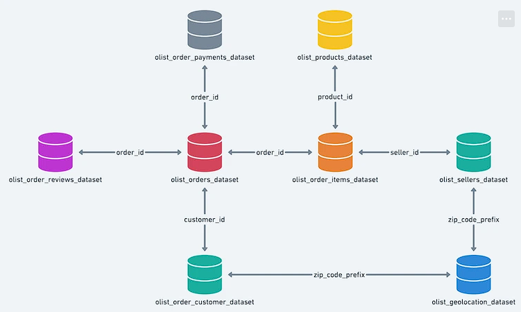
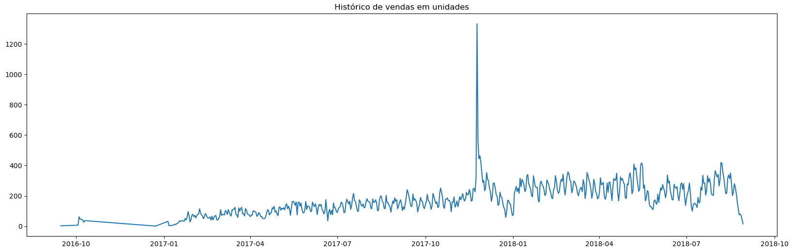
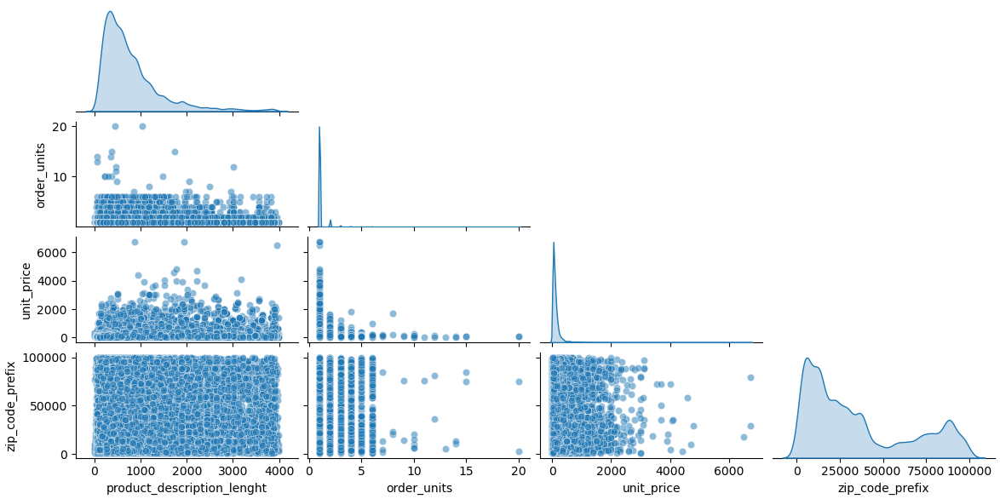
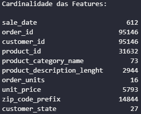
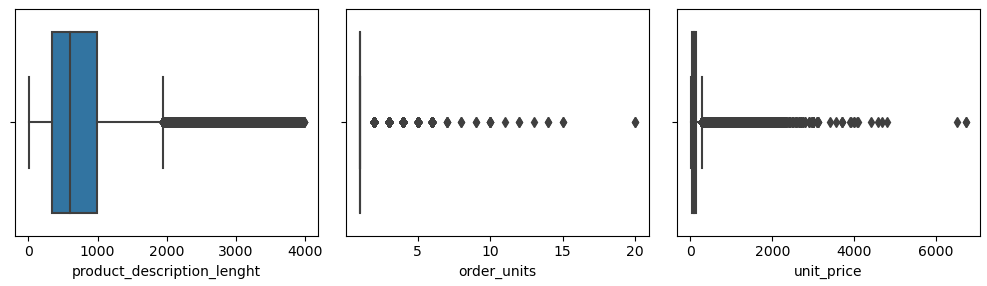
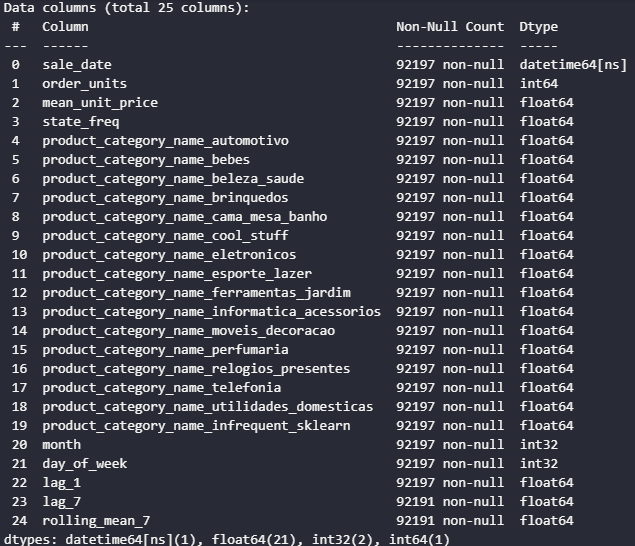
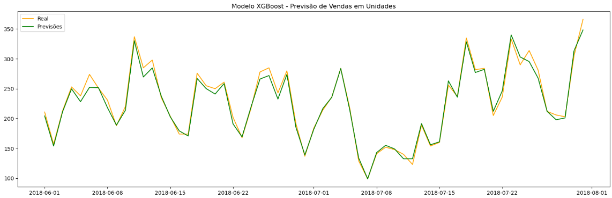
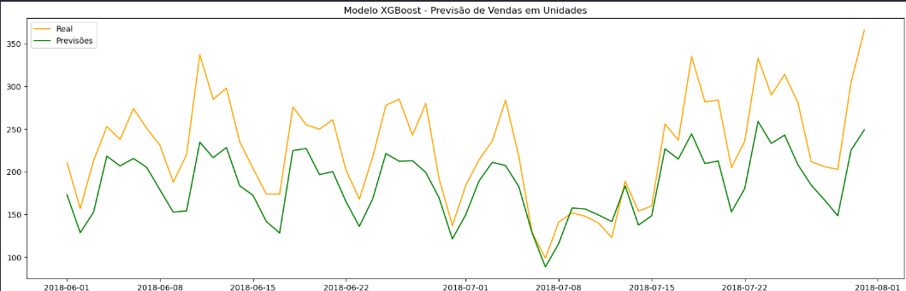
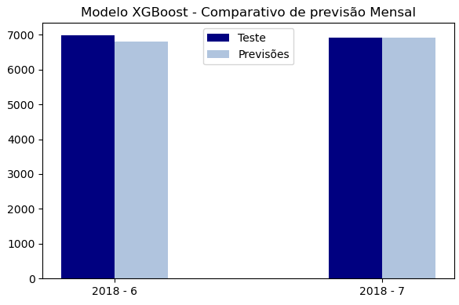
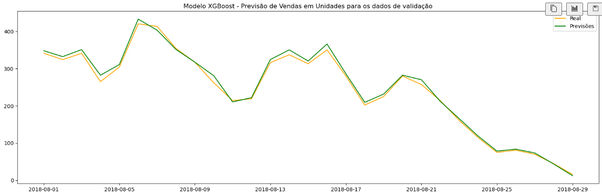

[](https://www.linkedin.com/in/pedro-bull-0363ba1a1/)
[](https://www.python.org/)

# Previsão de Vendas Futuras - E-commerce brasileiro

O marketplace Olist, um dos maiores do Brasil, precisa de um modelo de previsão de vendas para melhorar seus processos logísticos e planejamento financeiro à curto e médio prazo. Para isso, dispõe de diversas bases de dados com informações sobre pedidos, avaliações de clientes, vendedores cadastrados, geolocalização de usuários e sellers, informações sobre produtos e vendas históricas. 


[Link original para o dataset](https://www.kaggle.com/datasets/olistbr/brazilian-ecommerce)

<p align="center"> 
  <a href="https://www.linkedin.com/in/pedro-bull-0363ba1a1/" target="_blank"></a> 
</p>

## Objetivos

O objetivo deste projeto é, partindo do conjunto de dados fornecidos pela empresa, construir um processo de ETL para criar uma base de vendas históricas da empresa com 24 meses, partido de outubro de 2016. Em seguida, aplicar técnicas de ciência de dados para criar um modelo de previsão de vendas para a empresa. Com isso, é possível otimizar o planejamento logístico e financeiro da mesma no médio prazo, trazendo resultados consistentes e confiáveis sobre a tendência do que deve acontecer em relação às suas vendas nos próximos meses, seja em relação ao faturamento total em unidades ou, também, em relação ao faturamento por estado e/ou categoria de produtos. 


## Estrutura do repositório

O repositório está estruturado da seguinte forma:

```
├── data
├── images
├── models
├── notebooks
├── reports
```

- Na pasta `data` estão os dados utilizados no projeto. A base de dados original gerada a partir dos arquivos fornecidos pela empresa é a `sales_db_01.csv`, sendo que datasets seguintes foram gerados durante o projeto e salvos na pasta para fins de organização e versionamento. O dataset final para alimentar o modelo está contido no arquivo `sales_db_03.csv`.
- Na pasta `images` estão as imagens utilizadas neste README.
- Na pasta `models` estão os modelos gerados durante o projeto. 
- Na pasta `notebooks` estão os notebooks com o desenvolvimento do projeto. Em detalhes, temos:
  - [`01_sales_pred_db_creation`](notebooks/01_sales_pred_db_creation.ipynb): notebook com construção da base de dados inicial.   a análise exploratória dos dados usando [ydata-profiling](https://github.com/ydataai/ydata-profiling) e Seaborn.
  - [`02_sales_pred_eda.ipynb`](notebooks/02_sales_pred_eda.ipynb): notebook com as etapas de data cleaning e análise exploratória dos dados usando [ydata-profiling](https://github.com/ydataai/ydata-profiling) e Seaborn.
  - [`03_sales_pred_feature_eng.ipynb`](notebooks/03_sales_pred_feature_eng.ipynb): notebook com a aplicação de engenharia de recursos para ajuste dos dados antes de fornece-los ao modelo.
  - [`04_sales_pred_model.ipynb`](notebooks/04_sales_pred_model.ipynb): notebook com a criação do modelo de previsão.
  - [`05_sales_pred_model_validation.ipynb`](notebooks/05_sales_pred_model_validation.ipynb): notebook com a etapa de validação do modelo.

- Na pasta `reports` estão os relatórios gerados durante o projeto utilizando a biblioteca [ydata-profiling](https://github.com/ydataai/ydata-profiling).

As bases de dados originais fornecidas pela empresa estão estruturadas conforme a imagem abaixo. Esses arquivos podem ser baixados através [link original para o dataset](https://www.kaggle.com/datasets/olistbr/brazilian-ecommerce). A partir desses dados, a base inicial para o projeto foi construida conforme detalhado no notebook [`01_sales_pred_db_creation`](notebooks/01_sales_pred_db_creation.ipynb).




## Etapa 1 - Construção da base de dados

A base de dados [`sales_db_01.csv`](dados/`sales_db_01.csv`) foi agrupada de forma que cada linha represente um produto vendido. Ou seja, para pedidos com mais de um produto, por exemplo, o código de identificação do pedido é o mesmo para cada um dos produtos comprados. A base contém os seguintes dados:

- `sale_date`: Data da venda
- `order_id`: Código de identificação do pedido
- `customer_id`: Código de identificação do cliente
- `product_id`: Código de identificação do produto do pedido
- `product_category_name`: Categroia do Produto
- `product_description_lenght`: Número de caracteres na descrição do anúncio produto
- `order_units`: Unidades do produto no pedido
- `unit_price`: Preço unitário do produto
- `zip_code_prefix`: Prefixo do CEP do cliente
- `customer_state`: UF de destino do pedido


## Etapa 2 - Data Cleaning e Análise Exploratória

Após a limpeza e correção dos dados, foi gerado um relatório preliminar com o [ydata-profiling](https://github.com/ydataai/ydata-profiling). A figura abaixo mostra o comportamento histórico das vendas


Em seguida, a correlação das variáveis foi avaliada em pares com o gráfico de pairplot. Para essa análise, o objetivo é entender, com os gráficos de dispersão, como cada par de variáveis está relacionado. Além disso, foi gerada uma tabela para avaliar a cardinalidade(número de valores distintos) de cada uma das colunas.





Após as análises, as seguintes conclusões foram tomadas:

- Avaliando a cardinalidade das colunas(número de valores distintos), temos que as colunas de order-id, customer_id, product_id são números de identificação específicos para cada pedido. Esse tipo de informação não agrega valor à análise e, por isso, as colunas serão desconsideradas;
- Avaliando o pairplot, temos que a coluna de product_description_lenght não tem correlação relevante com o número de unidades vendidas. Assim, essa coluna foi excluida;
- A coluna de zip_code_prefix também será excluida para evitar duplicidade de informações, já que a região de venda é representada pela coluna customer_state.


Por fim, foram utilizados gráficos de boxplot para avaliar tanto a distribuição estatítica dos dados quanto a existência de outliers. 



Avaliando especificamente a coluna target ('order_units'), temos:


De fato existem poucos registros de vendas de mais de uma unidade no mesmo pedido. Porém, esses dados serão mantidos, já que não existe um padrão claro para a venda de mais unidades de um produto por pedido e, ao que tudo indica, é apenas a representação da dinâmica de vendas de determinados produtos

## Etapa 3 - Feature Engineering

Após o completo entendimento dos dados, na etapa 3 fora feitos os ajustes necessários nas features para formatá-las de modo que o modelo de machine learning consiga interpretá-los.

O primeiro tratamento aplicado à base for para a coluna categórica 'product_category_name', que tinha 73 valores distintos inicialmente e com formato de texto. Dessa forma, adotei a abordagem de selecionar as categorias que representam 80% dos registros de venda, totalizando 15 categorias, para manter no modelo, agrupando o restante como um único grupo. Com essa abordagem, foi possível manter as categorias mais representativas sem aumentar demasiadamente a dimensionalidade da base de dados. Como nessa etapa a base conta com apenas 5 colunas, sendo que uma delas é a coluna target, a adição de outras 15 colunas para descrever as categorias foi uma abordagem adequada.

Assim, foi aplicado o OneHotEncoder para transformar as informações categóricas de texto para valores numéricos, sendo que cada coluna adicionada representa uma categoria distinta e valores binários, com 1 indicando que a venda pertece àquela categoria e 0 indicando o contrário.

Avançado para a coluna 'custome_state', a abordagem escolhida foi a Codificação Frequencial. Essa técnica serve para transformar variáveis categóricas em valores numéricos com base na frequência de ocorrência de cada categoria no conjunto de dados em relação à variável target. Como exemplo, se 40% das vendas foram feitas para o estado de São Paulo, a sigla SP será substituida por 0.4 em todos os registros de vendas. Esse racional foi replicado para todos os estados brasileiros.

A Codificação Frequencial foi escolhida para evitar aumentar ainda mais a dimensionalidade da base, já que após a transformação da coluna de categorias de produtos, a base já possuia 20 colunas. Além disso, como um dos objetivos é prever a venda por estado, não seria útil agrupar estados menos frequentes em vendas, por exemplo.

Por fim, o último tratamento aplicado à base de dados foi a inclusão de features ligadas à coluna de datas com o objetivo de facilitar a captura de padrões temporais e sazonalidade por parte do modelo. Foram incluidas 3 colunas:

- `lag_1` : Total de vendas registradas no dia anterior.
- `lag_7` : Total de vendas registradas nos sete dias anteriores.
- `rolling_mean_7`: A média das vendas nos últimos 7 dia

Ao final, a base de dados preparada pelo modelo apresenta as seguintes características:



Com a base de dados definida, separei o último mês dos registros em uma base a parte para aplicar ao modelo finalizado e avaliar a performance em dados não vistos pelo modelo. Essa é uma abordagem eficaz pára simular um ambiente de produção para uma validação preliminar do modelo.

## Etapa 4 - Criando o Modelo

Na etapa de criação do modelo, conforme detalhado na introdução, foi escolhido o modelo XGBoost(Extreme Gradient Boosting).

O modelo foi definido incialmente com os seguintes hiperparâmetros:

- `n_estimators` : Número de árvores criadas pelo modelo - Valor: 150
- `objective` : Define a função de perda que o modelo usará para otimizar durante o treinamento - Valor: 'reg:squarederror'

Foi aplicada a validação cruzada para obeter um parâmetro inicial da performance do modelo e evitar o overfitting, chegando a um RMSE de 0.47, que representa um erro médio de 0.47 venda para cada registro.

Após o treinamento do modelo, foi obtido o seguinte resultado para os dados de teste:



Para o conjunto de testes, os resultados de erro obtidos foram semelhantes aos valores obtidos para a validação cruzada, sendo:

- `MSE` : 0.20
- `RMSE` : 0.45

A principal métrica análisada foi a `RMSE`, pois trás um erro médio na mesma escala dos dados, o que permite avaliar quantitativamente qual o erro médio de previsão para as unidades vendidas.

É importante destacar que esse foi o resultado atingido para a base de dados sem qualquer agrupamento, ou seja, cada linha representa uma venda de 'X' unidades de um produto de determinada categoria, em determinado estado e em determinado dia.

Em uma fase anterior, uma base de dados agrupada por data, categoria e estado tinha sido utilizada, ou seja, cada linha representava o total de vendas de um dia, para os produtos de determinada categoria em determinado estado. A base agrupada apresentou o seguinte resultado:



É perceptível que o agrupamento dos dados fez com que o modelo, apesar de capturar bem as tendências, não conseguisse capturar com precisão os padrões corretos entre os dados e, com isso, acabou subestimando boa parte das previsões, principalmente em períodos de alta. É possível corrigir esse comportamento fornecendo pesos personalizados ao modelo com base em um limiar, por exemplo. Porém, como a base desagrupada permitiu a captura dos padrões, a abordagem dos pesos personalizados não foi aplicada.

Agrupando os resultados por mês, é possível validar que o modelo obteve uma ótima performance, principalmente para a aplicações em um cenário de previsões de vendas futuras para planejamento de orçamento, por exemplo. Segue abaixo o resultado:



## Etapa 5 - Simulando o ambiente de produção para validação do modelo

Os dados não vistos, separados na etapa de Feature Engineering, foram fornecidos ao modelo e o resultado foi bastante semelhante aos dados de treinamento e teste do modelo, conforme segue abaixo:



Portanto, a partir dos resultados apresentados, é possível validar que o modelo de previsão de vendas para esse marketplace foi construido com sucesso, tendo uma boa performace em diversos cenários.
